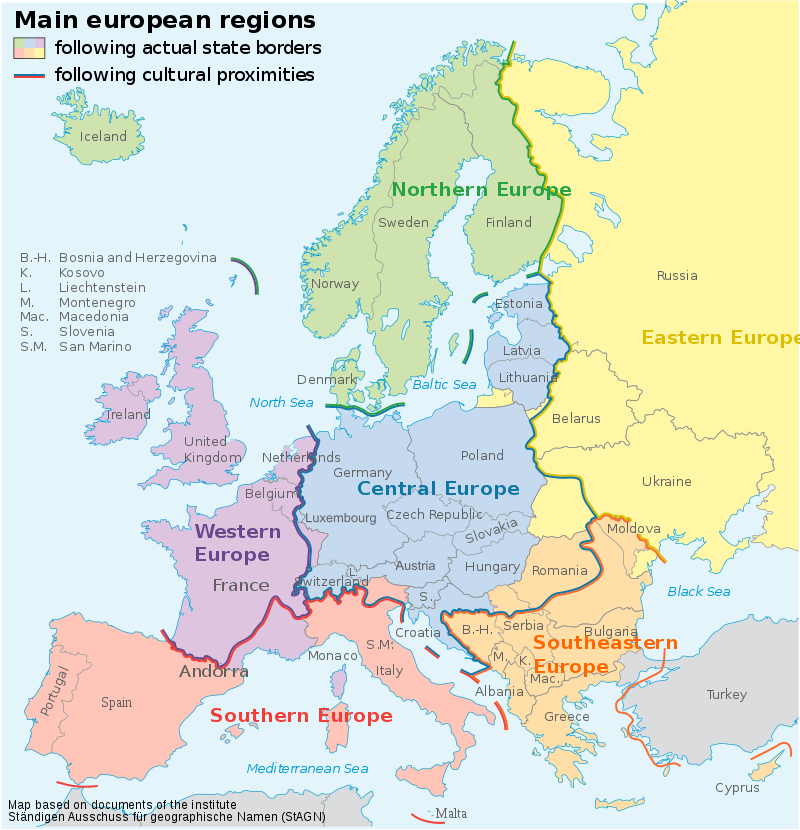

# European Union Summary 🇪🇺

 > ### EU is among one of the 7 continents in the world. EU is on 5th spot by land area and 3rd by population. 

1. Asia
2. Africa
3. Antarctica
4. Australia
5. Europe
6. North America
7. South America

## Definition of Europe
 **For the purposes of comparison the broader definition of Europe will be used. A sovereign state must meet at least one of the following criteria to be included:**

- Be a recognized European state by the United Nations geoscheme for Europe
- Be a member state of the European Union(EU is made up of 28 states)
- Be a member state of the Eurozone (States referred to the euro as the official currency have.)
- Be a member state of the Council of Europe

### EU Regions

EU can be roughly divide into 5 regions as shown in this image from Wikipedia:

  <table data-role="table">
<thead><tr><th>Eastern Europe</th><th>Northern Europe</th><th>Southern Europe</th><th>Western Europe</th></tr></thead>
<tbody><tr><td>Belarus </td><td>Åland Islands</td><td>Albania</td><td>Austria</td></tr><tr><td>Bulgaria</td><td>Denmark</td><td>Andorra</td><td>Belgium</td></tr><tr><td>Czech Republic</td><td>Estonia</td><td>Bosnia and Herzegovina</td><td>France</td></tr><tr><td>Republic of Moldova</td><td>Faroe Islands</td><td>Croatia</td><td>Germany</td></tr><tr><td>Poland</td><td>Finland</td><td>Gibraltar</td><td>Liechtenstein</td></tr><tr><td>Hungary</td><td>Guernsey</td><td>Greece</td><td>Luxembourg</td></tr><tr><td>Romania</td><td>Iceland</td><td>Italy</td><td>Monaco</td></tr><tr><td>Russian Federation </td><td>Republic of Ireland</td><td>Republic of Macedonia</td><td>Netherlands</td></tr><tr><td>Slovakia</td><td>Jersey</td><td>Malta</td><td>Switzerland</td></tr><tr><td>Ukraine</td><td>Isle of Man</td><td>Montenegro</td><td></td></tr><tr><td></td><td>Latvia</td><td>Portugal</td><td></td></tr><tr><td></td><td>Lithuania</td><td>San Marino</td><td></td></tr><tr><td></td><td>Norway</td><td>Serbia</td><td></td></tr><tr><td></td><td>Sark</td><td>Slovenia</td><td></td></tr><tr><td></td><td>Svalbard and Jan Mayen</td><td>Spain</td><td></td></tr><tr><td></td><td>Sweden</td><td>Vatican City</td><td></td></tr><tr><td></td><td>United Kingdom</td><td></td><td></td></tr></tbody>
</table>

   - Eastern Europe is the most populated region because it includes Russia(143 million) which is biggest country in the world.
   
   - Central Europe is the second most populated country in Europe, thanks to Germany( 82 million) which is the second most populated region.
    
   - Northern Europe is the least populated, despite the fact that it includes the United Kingdom(66 million), which is the fifth most populated country on the continent.

### List of top 10 EU countries by population as on 2018:

<table >
<tbody><tr>
<th>Rank</th>
<th>Country</th>
<th>Official population</th>
<th>Date</th>
<th>Regional grouping</th>
<th>Source
</th></tr>
<tr >
<td>1</td>
<td align="left">🇷🇺 Russia</td>
<td>146,877,088</td>
<td>January 1, 2018
</td>
<td>EAEU</td>
<td align="left">Official Estimate
</td></tr>
<tr>
<td>2</td>
<td align="left">🇩🇪 Germany</td>
<td>82,887,000</td>
<td>June 30, 2018
</td>
<td>EU</td>
<td align="left">Official estimate
</td></tr>
<tr >

<td>3</td>
<td align="left">🇹🇷 Turkey</td>
<td>82,003,882</td>
<td>December 31, 2018
</td>
<td></td>
<td align="left">Official estimate
</td></tr>
<tr>
<td>4</td>
<td align="left">🇫🇷 France</td>
<td>67,372,000</td>
<td>November 1, 2018
</td>
<td>EU</td>
<td align="left">Monthly official estimate
</td></tr>
<tr>
<td>5</td>
<td align="left">🇬🇧 United Kingdom</td>
<td>66,040,229</td>
<td>June 30, 2017
</td>
<td>EU</td>
<td align="left">Official annual estimate
</td></tr>
<tr>
<td>6</td>
<td align="left">🇮🇹 Italy</td>
<td>60,390,560</td>
<td>September 30, 2018
</td>
<td>EU</td>
<td align="left">Monthly official estimate
</td></tr>
<tr>
<td>7</td>
<td align="left">🇪🇸 Spain</td>
<td>46,733,038</td>
<td>July 1, 2018
</td>
<td>EU</td>
<td align="left">Official estimate
</td></tr>
<tr>
<td>8</td>
<td align="left">🇺🇦 Ukraine></td>
<td>42,220,824</td>
<td>October 1, 2018
</td>
<td>EU</td>
<td align="left">Monthly official estimate
</td></tr>
<tr>
<td>9</td>
<td align="left">🇵🇱 Poland</td>
<td>38,433,600</td>
<td>December 31, 2017
</td>
<td>EU</td>
<td align="left">Official estimate
</td></tr>
<tr>
<td>10</td>
<td align="left">🇷🇴 Romania</td>
<td>19,523,621</td>
<td>January 1, 2018
</td>
<td>EU</td>
<td align="left">Official annual estimate
</td></tr>
</table>

### List of top 10 EU countries by GDP:

<table>
<tbody><tr>
<th >Rank</th>
<th>Country</th>
<th>GDP (Millions of US$)
</th></tr>
<tr>
<td></td>
<td>European Union</td>
<td>18,162,109
</td></tr>
<tr>
<td>1</td>
<td>Germany</td>
<td>3,930,000
</td></tr>
<tr>
<td>2</td>
<td>United Kingdom</td>
<td>2,770,000
</td></tr>
<tr>
<td>3</td>
<td>France</td>
<td>2,660,000
</td></tr>
<tr>
<td>4</td>
<td>Italy</td>
<td>2,050,000
</td></tr>
<tr>
<td>5</td>
<td>Russia</td>
<td>1,520,000
</td></tr>
<tr>
<td>6</td>
<td>Spain</td>
<td>1,420,000
</td></tr>
<tr>
<td>7</td>
<td>Netherlands</td>
<td>853,806
</td></tr>
<tr>
<td>8</td>
<td>Switzerland</td>
<td>650,431
</td></tr>
<tr>
<td>9</td>
<td>Sweden</td>
<td>558,949
</td></tr>
<tr>
<td>10</td>
<td>Poland</td>
<td>517,705
</td></tr>
</table>

### Best of EU
-  **Austria** has the lowest unemployment rate in the European Union and the Eurozone
-  **France has** the highest Net National Wealth of any European state
- **Germany**  is the current largest economy in Europe, the European Union and the Eurozone, with Germany remaining the Eurozone's largest economy
-  **Ireland** has the highest rating for Opportunity in Europe, the European Union and the Eurozone

- **Luxembourg** is home to the highest GDP (nominal) per capita in both the European Union and Eurozone
- **Luxembourg** has the highest average wage in the European Union and Eurozone as well as the highest monthly minimum wage in the entirety of Europe
-  **Denmark** ranks highest on the World Happiness Report in Europe and the European Union

-  **Netherlands** has highest Human Development Index figure in the European Union and the Eurozone, and also ranks first in the EU and Eurozone on the Social Progress Index, as well as being the highest ranked country in the Eurozone on the World Happiness Index

### Worst of EU
-  **Armenia** has the largest percentage living under the poverty line of any state in Europe
-  **Bulgaria** has the smallest average wage and monthly minimum wage in the European Union
-  **Greece** has the highest public debt (as a percentage of GDP) of any European state, as well as having the largest unemployment rate in the European Union and Eurozone
-   **Greece** has the largest percentage living under the poverty line in the Eurozone, and is also ranked last on the Social Progress Index among Eurozone members, including for Opportunity
-  **Macedonia** has the highest unemployment rate of any European state
-   **Ukraine** has the smallest average wage in Europe, mostly as a result of ongoing political and military struggles
-   **United Kingdom** has the largest deficit of any country in Europe and the European Union

