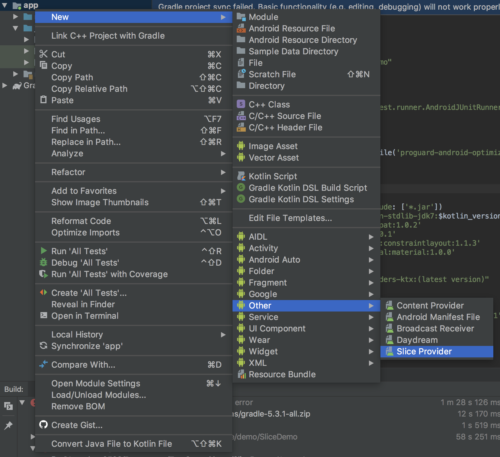
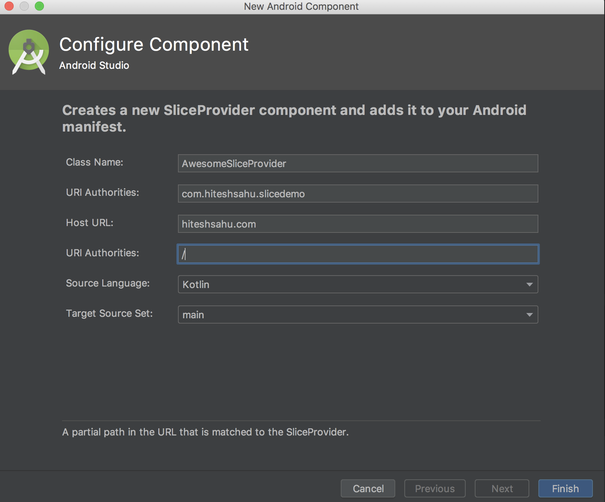
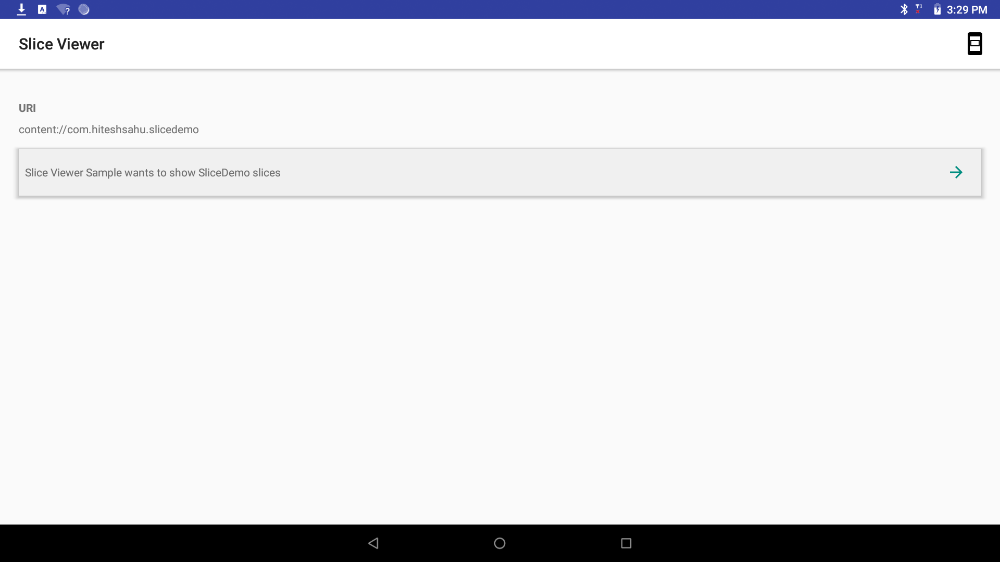
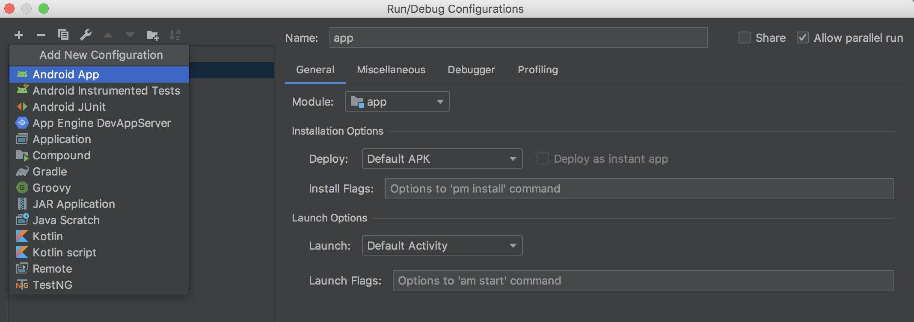
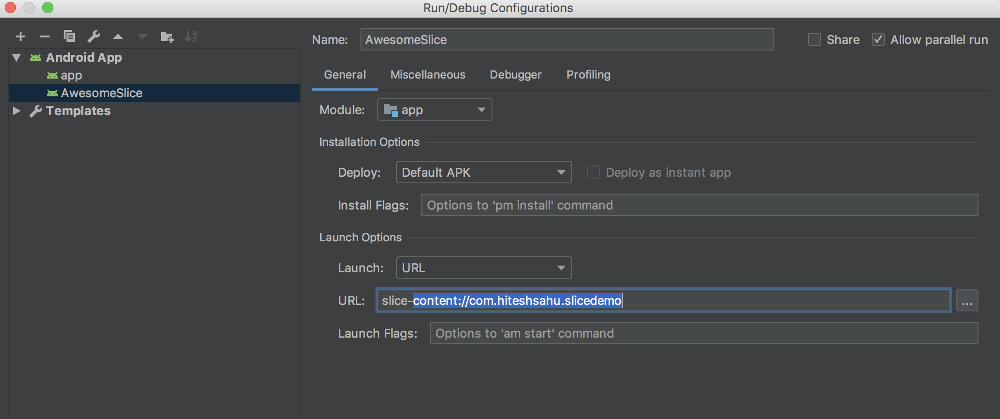
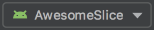
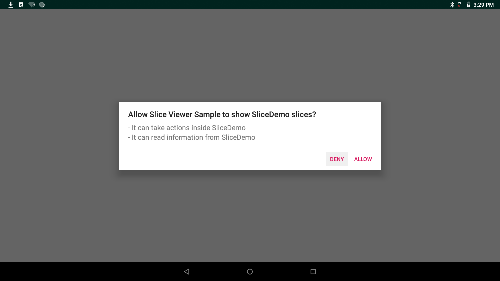

# How to Use Android Slices 🍰

> ### In Android, Slices are extenstion of _ContentProvider_ which allow developers to show a interactive slice of their app in apps like Google Search app, Google Assistant and other places.

      java.lang.Object
         ↳	android.content.ContentProvider
             ↳	android.app.slice.SliceProvider

#### Why **SliceProvider** extends **ContentProvider**

 Content Provider can be configured to allow other applications to securely access and modify your app's data. Android slices take use of this content-uri & Broadcast Reciever to support live-data, scrolling content, inline actions, and deep-linking.

Android framework already use content provider to store and provide audio, video, images, and personal contact information. The Content Provider can be used to one of the following use cases:

- Implement Custom Search suggestions in your application like _Google Search app_

- Expose your application data to Widgets like _Android Slices_

- Share complex data or files from your application to other applications like _Contact list_

### Backward Compatibilty

Android Slices are packed under **Behavior components of Jetpack** with backward compatibility up to **Android 4.4**, reaching (approximately 95% of all Android devices).

## Building Slices

 1. First update Android compile version in _build.gradle_.

         compileSdkVersion 28
            defaultConfig {
                applicationId "com.example.slices"
                minSdkVersion 20
                targetSdkVersion 28
                versionCode project.versionCode
                versionName project.versionName
            }

 2. Next open your Android Studio project, right-click on your app package, and select **New... > Other > Slice Provider** as shown in below **Screen shot:**

 

3. Now enter some meaningful name of _SliceProvider_ you want to add.  Here for demonstration I entered _AwesomeSliceProvider_

 

 4. Once you click on __Finish__ button this wizard gone auto generate **AwesomeSliceProvider** class & register that  into Android Manifest. This is because **SliceProvider** extends **ContentProvider**.

__Updated Android Manifest:__

     <application
            android:allowBackup="true"
            android:icon="@mipmap/ic_launcher"
            android:label="@string/app_name"
            android:roundIcon="@mipmap/ic_launcher_round"
            android:supportsRtl="true"
            android:theme="@style/AppTheme">

            <!--Slice data Provider-->
            <provider
                android:name=".AwesomeSliceProvider"
                android:authorities="com.hiteshsahu.slicedemo"
                android:exported="true">
                <intent-filter>
                    <action android:name="android.intent.action.VIEW" />

                    <category android:name="android.app.slice.category.SLICE" />

                    <data
                        android:host="hiteshsahu.com"
                        android:pathPrefix="/"
                        android:scheme="http" />
                </intent-filter>
            </provider>

           <!--Demo activity-->
            <activity
                android:name=".MainActivity"
                android:label="@string/app_name"
                android:theme="@style/AppTheme.NoActionBar">
                <intent-filter>
                    <action android:name="android.intent.action.MAIN" />

                    <category android:name="android.intent.category.LAUNCHER" />
                </intent-filter>
            </activity>
        </application>

## Viewing Slices

   In order to view slices you need to install [**Slice Viewer**](https://github.com/googlesamples/android-SliceViewer/releases) apk. 
 
   Slice Viewer apk can be download from latest relase on [https://github.com/googlesamples/android-SliceViewer/releases](https://github.com/googlesamples/android-SliceViewer/releases)
   
   After downloading the apk you can install it using command:

    adb install -r -t slice-viewer.apk

where:

- -r: This param replaces existing application
- -t: This param allow test packages

> Now Slice-Viewer apk can be used to handle your Slice URI (eg _slice-content://com.example.your.sliceuri_) & see how your slice gone look under **Google Search app** or **Google Assistant**.

 There are 2 ways we can launch the Slices:  

 1. from the command line &
 2. from the Android Studio. 

### 1. Launching the Slice Viewer tool via ADB

Install your app from Android Studio or via _adb_:

     adb install -t -r yourapp.apk

Now view your Slice by running the following command:

     adb shell am start -a android.intent.action.VIEW -d slice-content://com.example.your.sliceuri
      

where _content://com.example.your.sliceuri_ is your Slice URL

For the above demo app  it will be:

     adb shell am start -a android.intent.action.VIEW -d slice-content://com.hiteshsahu.slicedemo

Executing this command  will launch Slice-Viewer.apk to handles content uri. Auto generated slice from above example looks like this: 

 

**Problem with this approach is you need to keep track of all the slice URLs. This problem can be solved with the help of  help of Android Studio**

### 2.  Launch the Slice Viewer from Android Studio

You can configure Android Studio to launch your Slices from Run configuration

- In your project, select <strong>Run &gt; Edit Configurations...</strong>

- In the top-left corner, click the plus sign [+]
- Select <strong>Android App</strong>

 

- Give this config a name in the name field.
- Select your __app__ module in the <strong>Module</strong> dropdown

- Under <strong>Launch Options</strong>, select <strong>URL</strong> from the <strong>Launch</strong> dropdown
- Enter _slice-<your_url>_ in the URL field where <your_url> is your slice content URL & Click <strong>OK</strong>

 

Thats it, now you can use this configuration next time
to launch the Slice Viewer to view your Slice for _<your_url>_ from run

 

### View all of your Slices in one place

> #### You don't need to launch your slices each time after you do some changes. Slice-Viewer automatically store your content URL.

- Use the search bar to manually search for your Slices via URI like
  _content://com.example.android.app/hello_. Each time you search, that Slice got added to the list.
- Each time you launch the Slice Viewer tool with a Slice URI, the Slice is added to the list.
- You can swipe a Slice to remove it from the list.
- Tap the URI of the Slice to see a page containing only that Slice. This has
  the same effect as launching Slice Viewer with a Slice URI.

**Note:** _Nested scrolling is disabled while displayed in the list. You will need to Launch your Slice
into the single Slice Viewer to test your a slice with scrollable content._

You click on slices to launch the App

 

> #### Thats all for now. I gone cover how to create custom slices in next post.