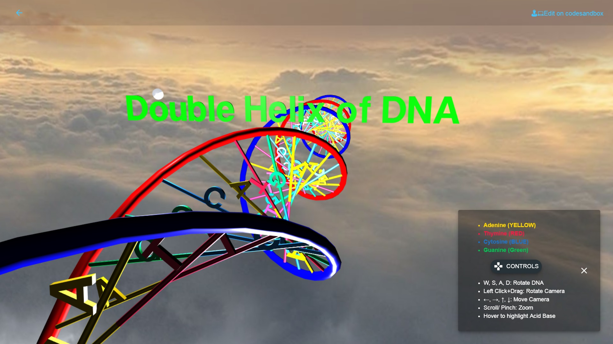
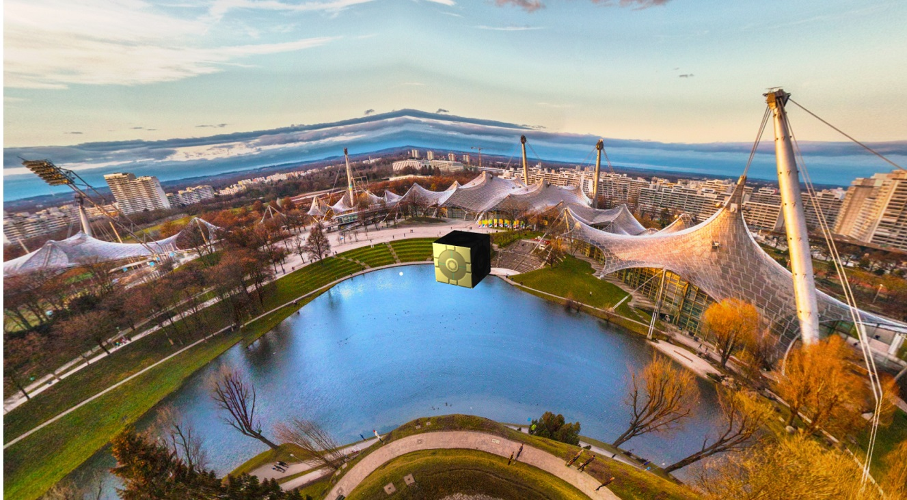

# How to Build SkyBox in ThreeJS        

 ## 1. Use a Cube with 6 images on its faces

  A cubeTextureloader is a special kind of texture that allow to load 6 sides for 6 faces of cube:

 - positive X
 - negative x
 - positive Y
 - negative Y
 - positive Z
 - negative Z

 Load 6 images for faces of cube and set it as scene background

            //images for faces
            const skyDome = [
            "./assets/img/experiments/skycube/px.jpg",
            "./assets/img/experiments/skycube/nx.jpg",
            "./assets/img/experiments/skycube/py.jpg",
            "./assets/img/experiments/skycube/ny.jpg",
            "./assets/img/experiments/skycube/pz.jpg",
            "./assets/img/experiments/skycube/nz.jpg"
            ];

          // Add Skybox
            const cubeTextureloader = new THREE.CubeTextureLoader();
            const texture = cubeTextureloader.load(skyDome);
            this.scene.background = texture;

### Result:

###  Live Demo: [Double Helix of DNA](http://hiteshsahu.com/DNA) 

------

 ## 2. Load a full Panaroma image  

            //Load Panaroma image
            let panaromaTexture = new THREE.TextureLoader().load(
            "https://images.pexels.com/photos/290595/pexels-photo-290595.jpeg"
            );
            panaromaTexture.magFilter = THREE.LinearFilter;
            panaromaTexture.minFilter = THREE.LinearFilter;

            //create material using texture  
            const shader = THREE.ShaderLib.equirect;
            const bgMaterial = new THREE.ShaderMaterial({
            fragmentShader: shader.fragmentShader,
            vertexShader: shader.vertexShader,
            uniforms: shader.uniforms,
            depthWrite: false,
            side: THREE.BackSide
            });

            bgMaterial.uniforms.tEquirect.value = panaromaTexture;
            const bgBox = new THREE.BoxBufferGeometry(200, 200, 200);
            let bgMesh = new THREE.Mesh(bgBox, material);
            this.scene.add(bgMesh);

### Result:

### Live Demo: [Munich OlympiaPark](http://hiteshsahu.com/OlympiaPark) 
